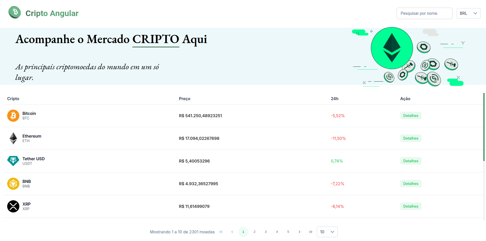

     

# CryptoAngular

O **CryptoAngular** é uma aplicação para visualização e acompanhamento de criptomoedas, consumindo a API pública da [Coinranking](https://coinranking.com/) para exibir uma listagem e gráficos detalhados dos ativos.



---

## Stack 🚀

**Frontend**

- **Angular (v20)**
- **PrimeNG**
- **Chart.js**
- **RxJS**
- **SCSS**

**API (Externa)**

- **Coinranking API**

## Rodando Localmente ⚡️

Existem duas maneiras de rodar o projeto: **manualmente** ou com **Docker**.

### Manualmente ⚒️

1.  Clone o repositório:

    ```bash
    git clone https://github.com/dev-araujo/crypto-angular.git
    ```

2.  Instale as dependências:

    ```bash
    npm install
    ```

3.  Execute o servidor de desenvolvimento:

    ```bash
    ng serve
    ```

    _Obs: O projeto utiliza um token de acesso da API Coinranking que está fixado no [environment.ts](https://www.google.com/search?q=src/environments/environment.ts)._

⭐ A aplicação estará disponível em `http://localhost:4200`.

### Com Docker 🐋

#### 📋 Pré-requisitos

Certifique-se de que você tem o [Docker](https://www.docker.com/get-started) e o [Docker Compose](https://docs.docker.com/compose/install/) instalados.

1.  Clone o repositório:

    ```bash
    git clone https://github.com/dev-araujo/crypto-angular.git
    ```

2.  Execute o Docker Compose para construir a imagem e iniciar o contêiner.

    ```bash
    docker-compose up -d
    ```

    ou

    ```bash
    docker compose up -d
    ```

⭐ A aplicação estará disponível em `http://localhost:4201`.

---

#### Autor 👷


[Adriano P Araujo](https://www.linkedin.com/in/araujocode/)
